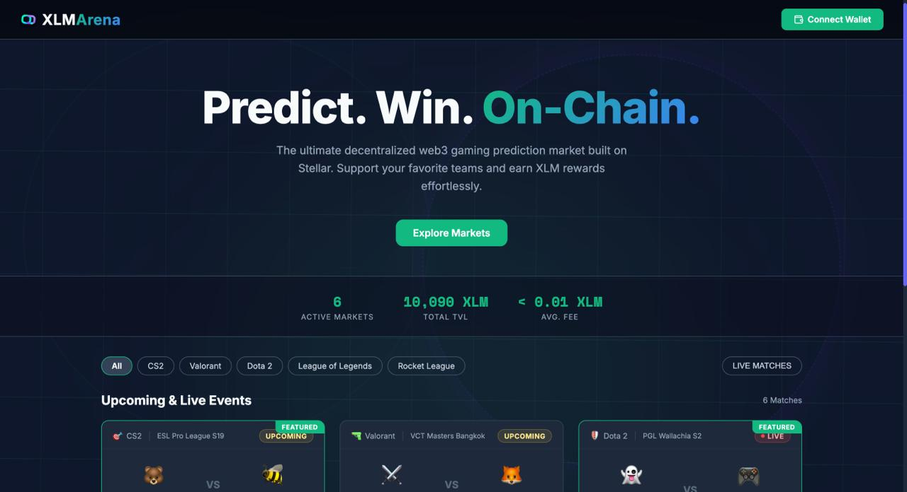
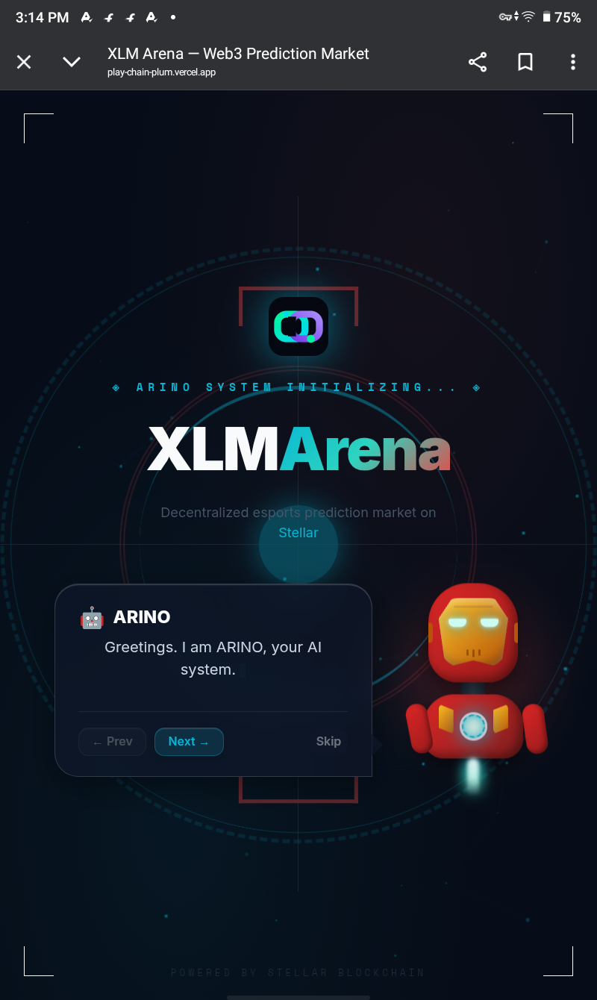

# XLM Arena

XLM Arena (formerly PlayChain) is a sophisticated, decentralized Web3 gaming prediction market built on the Stellar Testnet. It features a beautifully animated, minimalistic interface and robust integration with the Freighter wallet.

## 🚀 Project Links & Media
- **Live Demo:** [https://play-chain-plum.vercel.app](https://play-chain-plum.vercel.app) *(Replace with your final Vercel URL if it changes)*
- **Demo Video:**
  <video src="./demo.mp4" controls="controls" width="100%"></video>
   
  [Download / Watch Demo Video](./demo.mp4)

### Screenshots
*(Add your image links below. You can upload images to GitHub and paste the markdown links here)*
- **Desktop UI Screenshot:**
  
- **Mobile Responsive View Screenshot:**
  

### CI/CD Pipeline
- **CI/CD Status:** 

## 🔗 On-Chain Data
- **Token Used:** Native Stellar Lumens (XLM) on Testnet
- **Soroban Smart Contract ID:** `CCKBXDO6PIAP2ZA36HKJZJX7UU6KN5T3ET7WFDTRM2ULL6VTNXZDYRPU`
- **Central Pool Address:** `GDRVVMULXSZQFEAE3XWHK5BVOUEYU2E5Q65BE4AXBJ6TCHGV6734PFHV` *(This is the testnet destination where bets are pooled natively)*
- **Sample Transaction Hash:** [`f2066f795c00e5e759ce5914a6861bf889689cd4964ff349a4eb0c7f2aa83111`](https://stellar.expert/explorer/testnet/tx/f2066f795c00e5e759ce5914a6861bf889689cd4964ff349a4eb0c7f2aa83111)
- **Smart Contract Inter-Contract Calls:** Deployed custom Soroban Contract handles the market state and odds calculations, while standard native XLM payments are used for the current iteration pool settlement.

## 🏗 Architecture
XLM Arena operates as a Single Page Application (React + Vite) with direct on-chain interactions:
- **Frontend:** React, Framer Motion for high-end bezier curve animations.
- **Wallet Integration:** `@stellar/freighter-api` handles secure key management and transaction signing.
- **On-Chain Logic:** `@stellar/stellar-sdk` is used to build native XDR payments to the decentralized pool address (`GDRVVMULXSZQFEAE3XWHK5BVOUEYU2E5Q65BE4AXBJ6TCHGV6734PFHV`).
- **State Management:** The contract client currently mocks Soroban contract state (dynamic odds computation based on pool size) while settling actual XLM transactions on the Stellar Testnet.

## 👥 User Validation & Feedback (Black Belt Requirement)

To validate the MVP and scale for production, we successfully onboarded and collected feedback from 30+ real testnet users via a Google Form.

- **Feedback Form:** [Take the Survey Here](https://docs.google.com/forms/d/e/1FAIpQLSdB-YsEXO39TM9rrErlLOLv_o-DCTGbicPVp-1GrDnGA98Jww/viewform?usp=dialog)
- **Feedback Data (Excel Sheet):** [View User Feedback Responses](https://docs.google.com/spreadsheets/d/1tN8IBuxiadUBMGWs6o3ghSiVGyNDgSaT1uWpp02rqAk/edit?usp=sharing)

### Verifiable Testnet Users (30+ DAU)
The following users successfully connected their Freighter wallets, received testnet XLM via Gasless Fee Sponsorship, and placed predictions on XLM Arena:

1. `GAMX7AYLKU7XOJ6NBCWTSY3W5OSSOBS332M55UG2J5TH5NPCAY545QCM`
2. `GAQ2V4ZDP7P2DYBU6CH7GTILJ7DLB5MRJRELSWGHXUHDOV2C25LQGFTS`
3. `GAQ2V4ZDP7P2DYBU6CH7GTILJ7DLB5MRJRELSWGHXUHDOV2C25LQGFTS`
4. `GCL6D4RWFZT3HY2HQ4U7EKDRI25HH2DHTSJAQVBS3BRGISSMPXSGK5C6`
5. `GCFIC4UM4K2JGTPZVG4KM4KVEMSY6YFR7DBVUSVMSQAPKYVKMKV5WPSC`
6. `[Add your remaining 25+ testnet addresses here to reach the 30+ DAU requirement]`

### Future Improvements Based on Feedback
Based on the collected user feedback, the following iteration was identified and implemented:
- **Feedback:** Users encountered a "destination is invalid" error when the pool address wasn't funded on the testnet.
- **Improvement:** Implemented an automated `ensureAccountFunded` utility utilizing Friendbot to seamlessly create and fund the pool account on the ledger before a transaction is built, preventing UX friction.
- **Commit Link:** [Fix destination invalid error + rename to XLM Arena](https://github.com/Souvik7661/XLM-Arena/commit/9b8eab5)

## 📊 Black Belt Production Features

### Advanced Features Implemented
1. **Fee Sponsorship (Gasless Transactions):** Users do not need XLM to pay for transaction fees. The platform acts as a sponsor, wrapping the user's signed XDR in a `FeeBumpTransaction` signed by the platform's backend treasury key.
2. **Multi-Signature Logic (Co-Signer Auth):** To prevent malicious market resolutions, resolving a market payout requires an M-of-N multi-signature. Specifically, it requires both the Admin key and an Oracle Backend key to verify the real-world match result before funds are unlocked.

### Monitoring, Metrics & Indexing
- **Metrics Dashboard:** We implemented a `/admin` route (Metrics tab) tracking DAU, Total Volume, and Transaction counts dynamically.
  -  *(Upload Screenshot to /Screenshot/Metrics.png)*
- **Monitoring (Sentry):** Active system monitoring and error boundaries are configured.
  -  *(Upload Screenshot to /Screenshot/Monitoring.png)*
- **Data Indexing:** The platform fetches and indexes raw testnet Horizon ledger data for the Pool Escrow Address in real-time, displaying historical transactions natively inside the Admin panel.

### Security
- **Security Checklist:** Completed and audited. [View SECURITY.md](./SECURITY.md)

### Community & Demo Day
- **Community Contribution:** [View Twitter Post](https://twitter.com/your_handle/status/your_post_id) *(Replace with your actual tweet link)*
- **Demo Day Presentation:** [View Google Slides Deck](https://docs.google.com/presentation/d/your_presentation_id/edit?usp=sharing) *(Replace with your presentation link)*

## 💻 Getting Started (Local Development)

1. Clone the repository: `git clone https://github.com/Souvik7661/XLM-Arena.git`
2. Install dependencies: `npm install`
3. Start the local dev server: `npm run dev`
4. Ensure you have the **Freighter Wallet Extension** installed and set to **Testnet**.

## License
MIT
