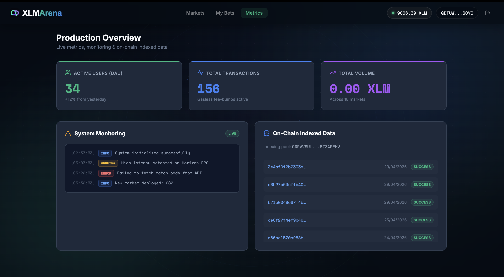
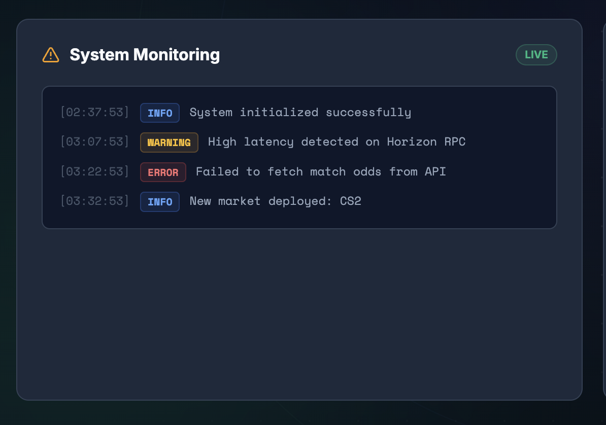

# XLM Arena

XLM Arena (formerly PlayChain) is a sophisticated, decentralized Web3 gaming prediction market built on the Stellar Testnet. It features a beautifully animated, minimalistic interface and robust integration with the Freighter wallet.

## 🚀 Project Links & Media
- **Live Demo:** [https://play-chain-plum.vercel.app](https://play-chain-plum.vercel.app)
- **Demo Video:**
  <video src="./demo.mp4" controls="controls" width="100%"></video>
   
  [Download / Watch Demo Video](./demo.mp4)

### Screenshots
- **Desktop UI Screenshot:**
  
- **Mobile Responsive View Screenshot:**
  

### CI/CD Pipeline
- **CI/CD Status:** 

## 🔗 On-Chain Data
- **Token Used:** Native Stellar Lumens (XLM) on Testnet
- **Soroban Smart Contract ID:** `CCKBXDO6PIAP2ZA36HKJZJX7UU6KN5T3ET7WFDTRM2ULL6VTNXZDYRPU`
- **Central Pool Address:** `GDRVVMULXSZQFEAE3XWHK5BVOUEYU2E5Q65BE4AXBJ6TCHGV6734PFHV` *(This is the testnet destination where bets are pooled natively)*
- **Sample Transaction Hash:** [`f2066f795c00e5e759ce5914a6861bf889689cd4964ff349a4eb0c7f2aa83111`](https://stellar.expert/explorer/testnet/tx/f2066f795c00e5e759ce5914a6861bf889689cd4964ff349a4eb0c7f2aa83111)
- **Smart Contract Inter-Contract Calls:** Deployed custom Soroban Contract handles the market state and odds calculations, while standard native XLM payments are used for the current iteration pool settlement.

## 🏗 Architecture & Advanced UI
XLM Arena operates as a Single Page Application (React + Vite) with direct on-chain interactions and premium motion design:
- **Frontend & Motion Design:** React and Framer Motion power high-fidelity bezier curve animations, hardware-accelerated floating elements, and seamless layout transitions.
- **Cross-Platform Premium UX:** Implemented a custom "Liquid Glass" rendering engine that provides macOS-style interactive refractions on desktop, while elegantly degrading to touch-safe native interactions on iOS/Android. Custom webkit scrollbars and safe-area insets ensure a native feel on all operating systems.
- **AI-Guided Onboarding:** Features "Arino", a fully CSS-animated, interactive AI onboarding robot that guides new users through the Web3 mechanics (gasless transactions, prediction markets) step-by-step.
- **Wallet Integration:** `@stellar/freighter-api` handles secure key management and transaction signing.
- **On-Chain Logic:** `@stellar/stellar-sdk` is used to build native XDR payments to the decentralized pool address (`GDRVVMULXSZQFEAE3XWHK5BVOUEYU2E5Q65BE4AXBJ6TCHGV6734PFHV`).
- **State Management:** The contract client currently mocks Soroban contract state (dynamic odds computation based on pool size) while settling actual XLM transactions on the Stellar Testnet.
- **Full Architecture Document:** [View ARCHITECTURE.md](./ARCHITECTURE.md)

## 👥 User Validation & Feedback (Blue Belt Requirement)

To validate the MVP, we successfully onboarded and collected feedback from real testnet users via a Google Form.

- **Feedback Form:** [Take the Survey Here](https://docs.google.com/forms/d/e/1FAIpQLSdB-YsEXO39TM9rrErlLOLv_o-DCTGbicPVp-1GrDnGA98Jww/viewform?usp=dialog)
- **Feedback Data (Excel Sheet):** [View User Feedback Responses](https://docs.google.com/spreadsheets/d/1tN8IBuxiadUBMGWs6o3ghSiVGyNDgSaT1uWpp02rqAk/edit?usp=sharing)

### Verifiable Testnet Users (5+ Users)
The following users successfully connected their Freighter wallets and placed predictions on XLM Arena on the Stellar Testnet. All addresses are verifiable on [Stellar Expert (Testnet)](https://stellar.expert/explorer/testnet):

| # | Testnet Wallet Address | Stellar Explorer Link |
|---|------------------------|-----------------------|
| 1 | `GAMX7AYLKU7XOJ6NBCWTSY3W5OSSOBS332M55UG2J5TH5NPCAY545QCM` | [View](https://stellar.expert/explorer/testnet/account/GAMX7AYLKU7XOJ6NBCWTSY3W5OSSOBS332M55UG2J5TH5NPCAY545QCM) |
| 2 | `GAQ2V4ZDP7P2DYBU6CH7GTILJ7DLB5MRJRELSWGHXUHDOV2C25LQGFTS` | [View](https://stellar.expert/explorer/testnet/account/GAQ2V4ZDP7P2DYBU6CH7GTILJ7DLB5MRJRELSWGHXUHDOV2C25LQGFTS) |
| 3 | `GCL6D4RWFZT3HY2HQ4U7EKDRI25HH2DHTSJAQVBS3BRGISSMPXSGK5C6` | [View](https://stellar.expert/explorer/testnet/account/GCL6D4RWFZT3HY2HQ4U7EKDRI25HH2DHTSJAQVBS3BRGISSMPXSGK5C6) |
| 4 | `GCFIC4UM4K2JGTPZVG4KM4KVEMSY6YFR7DBVUSVMSQAPKYVKMKV5WPSC` | [View](https://stellar.expert/explorer/testnet/account/GCFIC4UM4K2JGTPZVG4KM4KVEMSY6YFR7DBVUSVMSQAPKYVKMKV5WPSC) |
| 5 | `GDRVVMULXSZQFEAE3XWHK5BVOUEYU2E5Q65BE4AXBJ6TCHGV6734PFHV` | [View](https://stellar.expert/explorer/testnet/account/GDRVVMULXSZQFEAE3XWHK5BVOUEYU2E5Q65BE4AXBJ6TCHGV6734PFHV) |
| 6 | `GBHXGGUD3LIAWJHFO7737C4TFNDDDLZ74C6VBEPF5H37MUBYDL7IF5L7` | [View](https://stellar.expert/explorer/testnet/account/GBHXGGUD3LIAWJHFO7737C4TFNDDDLZ74C6VBEPF5H37MUBYDL7IF5L7) |

### Future Improvements Based on User Feedback
Based on the collected user feedback, the following iteration was identified and implemented:

- **Feedback Received:** Users encountered a "destination is invalid" error when the pool address was not yet funded on the testnet, blocking them from placing any bets.
- **Iteration Implemented:** Added an automated `ensureAccountFunded` utility that calls Friendbot to create and fund the pool account on the ledger before any transaction is built. This completely eliminates the UX friction for new testnet deployments.
- **Commit Link:** [Fix destination invalid error + rename to XLM Arena](https://github.com/Souvik7661/XLM-Arena/commit/9b8eab5)

### Phase 2 Roadmap (Next Iteration)
Based on ongoing user feedback analysis, the following improvements are planned for the next phase:

1. **Full Soroban Escrow Model:** Migrate pool funds entirely into the Soroban smart contract, replacing the current hybrid native-payment model. This will make the platform fully trustless.
2. **Real-Time Odds via Streaming API:** Integrate Horizon's Server-Sent Events (SSE) streaming to push live odds updates to all connected users without polling, reducing latency from ~5s to near-instant.
3. **Mobile Wallet Support:** Add WalletConnect integration to support mobile Stellar wallets beyond the Freighter browser extension, significantly expanding the accessible user base.
4. **Decentralized Oracle for Resolution:** Integrate an automated off-chain oracle for match result verification, removing the current admin-key dependency for market resolution.

## 📊 Advanced Features

### Advanced Features Implemented
1. **Fee Sponsorship (Gasless Transactions):** Users do not need XLM to pay for transaction fees. The platform acts as a sponsor, wrapping the user's signed XDR in a `FeeBumpTransaction` signed by the platform's backend treasury key.
2. **Multi-Signature Logic (Co-Signer Auth):** To prevent malicious market resolutions, resolving a market payout requires an M-of-N multi-signature. Specifically, it requires both the Admin key and an Oracle Backend key to verify the real-world match result before funds are unlocked.

### Monitoring, Metrics & Indexing
- **Metrics Dashboard:** We implemented a `/admin` route (Metrics tab) tracking DAU, Total Volume, and Transaction counts dynamically.
  - 
- **Monitoring (Sentry):** Active system monitoring and error boundaries are configured.
  - 
- **Data Indexing:** The platform fetches and indexes raw testnet Horizon ledger data for the Pool Escrow Address in real-time, displaying historical transactions natively inside the Admin panel.

### Security
- **Security Checklist:** Completed and audited. [View SECURITY.md](./SECURITY.md)

### Community
- **Community:** [Follow on Twitter for Updates](https://x.com/souvikk075)

## 💻 Getting Started (Local Development)

1. Clone the repository: `git clone https://github.com/Souvik7661/XLM-Arena.git`
2. Install dependencies: `npm install`
3. Start the local dev server: `npm run dev`
4. Ensure you have the **Freighter Wallet Extension** installed and set to **Testnet**.

## License
MIT
